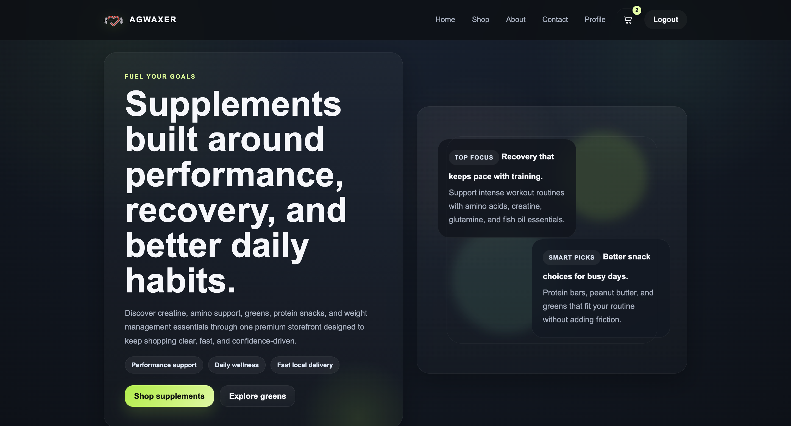
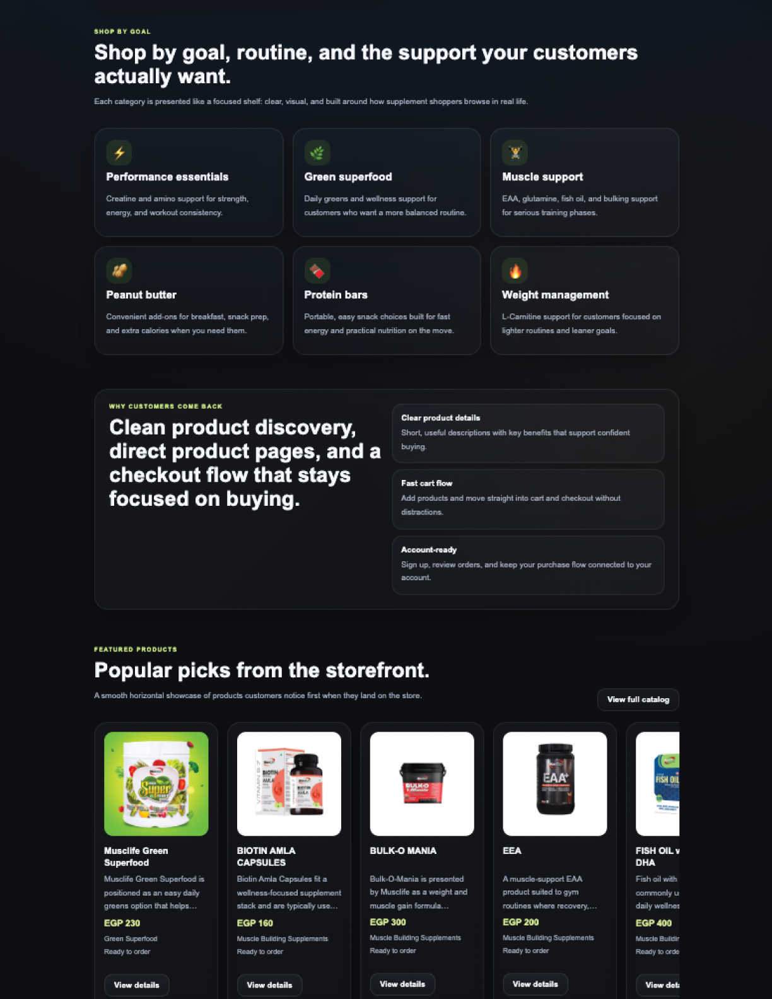
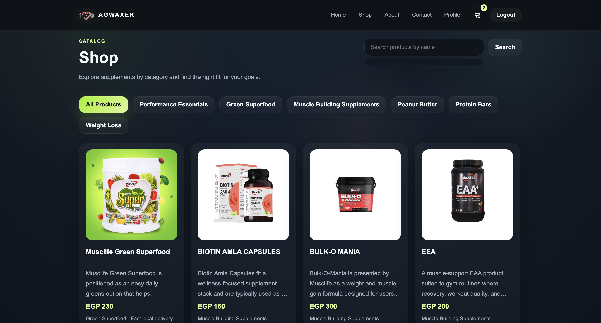
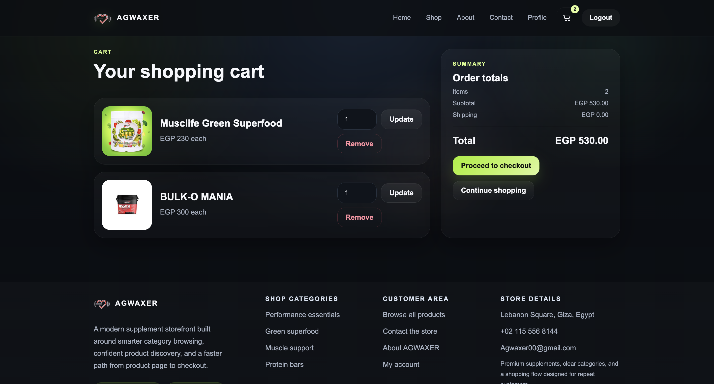

<p align="center">
  
</p>
# 🛒 Supplements E-Commerce Store (Django)

A simple and practical e-commerce web application built with Django.
The project simulates an online store for nutritional supplements with a clean UI and a straightforward shopping flow.

---

## 🚀 Features

* 🛍️ Product listing with categories
* 🛒 Add to cart (session-based)
* 🔐 User authentication (sign up / login / logout)
* 💳 Basic checkout flow with saved orders
* 🔎 Live search suggestions
* 👤 User profile page
* 📩 Contact form (messages saved in database)

---

## 🛠️ Tech Stack

* **Backend:** Django (Python)
* **Frontend:** HTML, CSS, JavaScript
* **Database:** SQLite

---

## 📂 Project Structure

```bash
project/
├── accounts/        # Authentication (login, signup, profile)
├── shop/            # Products, cart, checkout
├── contact/         # Contact form
├── home/            # Landing page
├── core/            # Shared utilities
├── payment/         # Checkout logic
│
├── templates/       # HTML templates
├── static/          # CSS, JS, images
│
├── manage.py
└── requirements.txt
```


## 📸 Screenshots

<p align="center">
  
</p>

<p align="center">
  
  
</p>


## ⚙️ How to Run

```bash
python3 -m venv venv
source venv/bin/activate
pip install -r requirements.txt

python3 manage.py migrate
python3 manage.py runserver
```

Open in browser:
👉 http://127.0.0.1:8000/home/

---

## 🧪 Usage

* Browse products from the shop page
* Add items to cart
* Create an account or log in
* Complete a checkout
* View profile and orders

---

## 📊 What the Project Covers

* Full basic e-commerce flow
* Django authentication system
* Session handling (cart)
* Template reuse and clean structure
* Simple UI/UX improvements

---

## 📌 Notes

This project was built as a practice project to improve my understanding of Django and full-stack development.
The focus was on building a clean and functional application without overcomplicating the structure.

---

## 📌 Future Improvements

* Payment gateway integration
* Order tracking system
* UI animations and micro-interactions
* Better search and filtering

---

## 👤 Author

Ahmed Jamal

🔗 GitHub: https://github.com/AGamal-X
🔗 LinkedIn: https://www.linkedin.com/in/ahmdgamall/

---

## ⭐ Project Highlights

This project demonstrates:

* Building a full-stack web application using Django
* Handling user authentication and sessions
* Designing a clean and usable UI
* Structuring a project in a maintainable way
